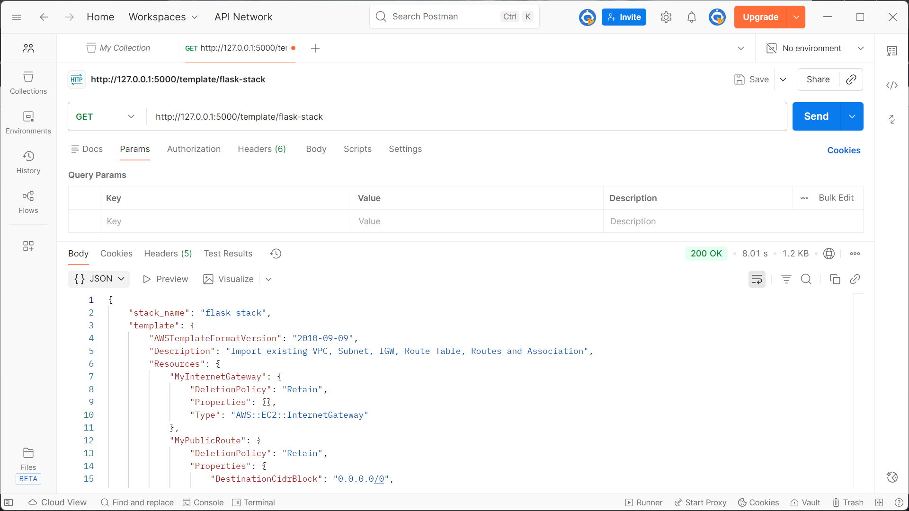

# AWS Security Developer Assignment 
## AWS | Python Flask | API Integration | CloudFormation | boto3 | Postman

### Project Overview
This project is a backend application built using Python, Flask, and Boto3, designed to interact with AWS CloudFormation and VPC networking components. It demonstrates automation of AWS resource management, CloudFormation template manipulation, and secure production-ready REST APIs.

Key functionalities:
- **GET** CloudFormation Template
- **PUT** Convert Public Subnet to Private
- **POST** Create CloudFormation ChangeSet

The Flask API communicates with AWS CloudFormation via boto3, and all API calls are tested using Postman.

---

### Tech Stack
- **Python**
  - Flask
  - Boto3
- **AWS**
  - CloudFormation  
  - VPC, Subnet, RouteTable, IGW
- Postman

---

### Pre-Requisites
- AWS Cloud infrastructure setup:
  - VPC (flask-app-vpc)
  - Public Subnet
  - Route Table
  - Internet Gateway  
- AWS CLI configured on local machine

---

## Implementation Steps

### **1. Create AWS Resources**
Create/import the AWS resources into a CloudFormation stack (`flask-stack`).  
Save the generated template as **template.yaml**.

---

### **2. Configure Local Project**
- Python Flask backend (`app.py`)
- `requirements.txt`  
Install dependencies:

```bash
pip install -r requirements.txt
````

---

### **3. Run the Flask Application**

```bash
py app.py
```

Server starts at:
[http://127.0.0.1:5000](http://127.0.0.1:500 0)

---

### **4. GET API – Retrieve CloudFormation Template**

The GET API fetches the CloudFormation stack template and returns it as JSON (YAML → JSON conversion via Boto3 + Python).  
The conversion is done by loading the YAML string into a Python dictionary, and Flask returns it as proper JSON in the response.

### **Request**

Postman GET Request:
```bash
GET /template/flask-app
```

### **Response**

```json
{
  "stack_name": "flask-stack",
  "template": {
    "AWSTemplateFormatVersion": "2010-09-09",
    "Description": "Import existing VPC, Subnet, IGW, Route Table, Routes and Association",
    "Resources": {
      "MyInternetGateway": {
        "DeletionPolicy": "Retain",
        "Properties": {},
        "Type": "AWS::EC2::InternetGateway"
      },
      "MyPublicRoute": {
        "DeletionPolicy": "Retain",
        "Properties": {
          "DestinationCidrBlock": "0.0.0.0/0",
          "GatewayId": "igw-0f58f70c27122313a",
          "RouteTableId": "rtb-0d96892830424e848"
        },
        "Type": "AWS::EC2::Route"
      },
      "MyRouteTable": {
        "DeletionPolicy": "Retain",
        "Properties": {
          "VpcId": "vpc-0342cf86f01583ce6"
        },
        "Type": "AWS::EC2::RouteTable"
      },
      "MySubnet": {
        "DeletionPolicy": "Retain",
        "Properties": {
          "AvailabilityZone": "us-east-1a",
          "CidrBlock": "10.0.0.0/28",
          "VpcId": "vpc-0342cf86f01583ce6"
        },
        "Type": "AWS::EC2::Subnet"
      },
      "MySubnetRouteTableAssociation": {
        "DeletionPolicy": "Retain",
        "Properties": {
          "RouteTableId": "rtb-0d96892830424e848",
          "SubnetId": "subnet-0e502f02bb78d2994"
        },
        "Type": "AWS::EC2::SubnetRouteTableAssociation"
      },
      "MyVPC": {
        "DeletionPolicy": "Retain",
        "Properties": {
          "CidrBlock": "10.0.0.0/24"
        },
        "Type": "AWS::EC2::VPC"
      }
    }
  }
}
```
Screenshot:  



---

### **5. PUT API – Convert Public Subnet to Private**

In AWS, a public subnet is identified by having a route to an Internet Gateway (IGW) in its route table.
A private subnet has no IGW route.  
The PUT API analyzes the CloudFormation template and programmatically identifies any route entries that point to an IGW (i.e., routes with DestinationCidrBlock = 0.0.0.0/0 and a GatewayId). If such a route exists, it is removed from the template.

By deleting the IGW route, the associated subnet no longer has direct internet access, effectively converting it from a public subnet into a private one. Hence, the subnet is changed from public to private.

### **Request**

Postman PUT Request:
```bash
PUT /template/convert
```

### **Body**

```json
{
  "stack_name": "flask-stack",
  "template": {
    "AWSTemplateFormatVersion": "2010-09-09",
    "Description": "Import existing VPC, Subnet, IGW, Route Table, Routes and Association",
    "Resources": {
      "MyInternetGateway": {
        "DeletionPolicy": "Retain",
        "Properties": {},
        "Type": "AWS::EC2::InternetGateway"
      },
      "MyPublicRoute": {
        "DeletionPolicy": "Retain",
        "Properties": {
          "DestinationCidrBlock": "0.0.0.0/0",
          "GatewayId": "igw-0f58f70c27122313a",
          "RouteTableId": "rtb-0d96892830424e848"
        },
        "Type": "AWS::EC2::Route"
      },
      "MyRouteTable": {
        "DeletionPolicy": "Retain",
        "Properties": {
          "VpcId": "vpc-0342cf86f01583ce6"
        },
        "Type": "AWS::EC2::RouteTable"
      },
      "MySubnet": {
        "DeletionPolicy": "Retain",
        "Properties": {
          "AvailabilityZone": "us-east-1a",
          "CidrBlock": "10.0.0.0/28",
          "VpcId": "vpc-0342cf86f01583ce6"
        },
        "Type": "AWS::EC2::Subnet"
      },
      "MySubnetRouteTableAssociation": {
        "DeletionPolicy": "Retain",
        "Properties": {
          "RouteTableId": "rtb-0d96892830424e848",
          "SubnetId": "subnet-0e502f02bb78d2994"
        },
        "Type": "AWS::EC2::SubnetRouteTableAssociation"
      },
      "MyVPC": {
        "DeletionPolicy": "Retain",
        "Properties": {
          "CidrBlock": "10.0.0.0/24"
        },
        "Type": "AWS::EC2::VPC"
      }
    }
  }
}
```

### **Response**

```json
{
  "message": "Subnet converted to private",
  "updated_template": {
    "AWSTemplateFormatVersion": "2010-09-09",
    "Description": "Import existing VPC, Subnet, IGW, Route Table, Routes and Association",
    "Resources": {
      "MyInternetGateway": {
        "DeletionPolicy": "Retain",
        "Properties": {},
        "Type": "AWS::EC2::InternetGateway"
      },
      "MyRouteTable": {
        "DeletionPolicy": "Retain",
        "Properties": {
          "VpcId": "vpc-0342cf86f01583ce6"
        },
        "Type": "AWS::EC2::RouteTable"
      },
      "MySubnet": {
        "DeletionPolicy": "Retain",
        "Properties": {
          "AvailabilityZone": "us-east-1a",
          "CidrBlock": "10.0.0.0/28",
          "VpcId": "vpc-0342cf86f01583ce6"
        },
        "Type": "AWS::EC2::Subnet"
      },
      "MySubnetRouteTableAssociation": {
        "DeletionPolicy": "Retain",
        "Properties": {
          "RouteTableId": "rtb-0d96892830424e848",
          "SubnetId": "subnet-0e502f02bb78d2994"
        },
        "Type": "AWS::EC2::SubnetRouteTableAssociation"
      },
      "MyVPC": {
        "DeletionPolicy": "Retain",
        "Properties": {
          "CidrBlock": "10.0.0.0/24"
        },
        "Type": "AWS::EC2::VPC"
      }
    }
  }
}
```

---

## **6. POST API – Create CloudFormation ChangeSet**

The POST API is responsible for taking the fully JSON-formatted CloudFormation template (including the modifications made by the PUT API) and submitting it to AWS CloudFormation as a ChangeSet. A ChangeSet allows to preview how infrastructure will change before actually applying the update.  
Once the ChangeSet is finished, the API returns the ChangeSet ID, its final status, and an optional status reason. This provides clear visibility into whether the stack update is valid and what changes CloudFormation has detected.

### **Request**

Postman POST Reaquest:
```bash
POST /changeset
```

### **Body**

```json
{
  "message": "Subnet converted to private",
  "updated_template": {
    "AWSTemplateFormatVersion": "2010-09-09",
    "Description": "Import existing VPC, Subnet, IGW, Route Table, Routes and Association",
    "Resources": {
      "MyInternetGateway": {
        "DeletionPolicy": "Retain",
        "Properties": {},
        "Type": "AWS::EC2::InternetGateway"
      },
      "MyRouteTable": {
        "DeletionPolicy": "Retain",
        "Properties": {
          "VpcId": "vpc-0342cf86f01583ce6"
        },
        "Type": "AWS::EC2::RouteTable"
      },
      "MySubnet": {
        "DeletionPolicy": "Retain",
        "Properties": {
          "AvailabilityZone": "us-east-1a",
          "CidrBlock": "10.0.0.0/28",
          "VpcId": "vpc-0342cf86f01583ce6"
        },
        "Type": "AWS::EC2::Subnet"
      },
      "MySubnetRouteTableAssociation": {
        "DeletionPolicy": "Retain",
        "Properties": {
          "RouteTableId": "rtb-0d96892830424e848",
          "SubnetId": "subnet-0e502f02bb78d2994"
        },
        "Type": "AWS::EC2::SubnetRouteTableAssociation"
      },
      "MyVPC": {
        "DeletionPolicy": "Retain",
        "Properties": {
          "CidrBlock": "10.0.0.0/24"
        },
        "Type": "AWS::EC2::VPC"
      }
    }
  }
}
```

### **Response**

```json
{
  "changeset_id": "arn:aws:cloudformation:us-east-1:982534382107:changeSet/changeset-1764861082/4c57941c-4515-4246-88fa-dbc2a6b1e561",
  "message": "ChangeSet creation finished",
  "status": "CREATE_COMPLETE",
  "status_reason": "OK"
}
```

```

---

